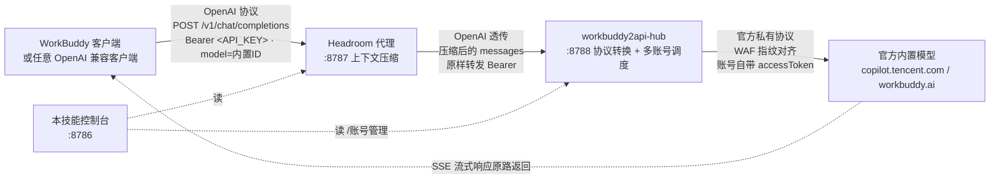

# iskill-headroom-workbuddy2api

把 **WorkBuddy 桌面端内置模型**（DeepSeek / Kimi / GLM / 混元 / MiniMax …）接成一个**任何人都能用的 OpenAI 兼容 API**。

## 一句话定位

> **hub 让内置模型「用得上」，headroom 让它「跑得远」。**

这个技能是**双价值**，两个组件各管一头，缺一不可地分工：

| 价值 | 组件 | 带来什么 | 缺了会怎样 |
|---|---|---|---|
| **能用** | **workbuddy2api-hub**（`:8788`） | 把官方**私有协议转成 OpenAI 兼容 API**；**看板 OAuth 加账号**（免抓包、免手抄 token）；多账号 **cn / intl 双区域调度**；每日 22:00 自动保活。 | 内置模型**根本接不出来**——没有它，这个技能不存在。 |
| **耐用** | **Headroom**（`:8787`） | **冻结历史前缀守住上游 prompt cache**（命中单价 = 未命中的 **2%**），**只压最新那条增量**。顺着缓存命中率把会话**跑得更久、更省**。 | 跑出来，但长会话更快撞上限、更费额度。 |

> 说清「省钱」这件事：这条链路上**真正的大头是上游缓存折扣（1 : 12 的杠杆）**，
> 压缩只占 1% 量级（实证与口径见 [`docs/token-savings-research.md`](docs/token-savings-research.md)）。
> headroom 的功劳是**把缓存守住了**，不是"压得多"。**别把它当压缩器卖。**

## 何时用
- 用户想给 WorkBuddy / Cursor / 任意 OpenAI 客户端加一个「模型来源 = WorkBuddy 内置模型、但带 token 压缩」的自定义模型。
- 用户说「本地起一个 OpenAI 兼容的内置模型 API」「用 Headroom 接 workbuddy2api」「localhost:8787 自定义模型」「自定义模型地址 http://localhost:8787/v1/chat/completions」。
- 用户已有 workbuddy2api-hub 或 Headroom 其中之一，想补齐另一半并串联起来。

## 架构流程图



> 链路：`客户端 → Headroom(:8787 压缩) → hub(:8788 转换) → 官方内置模型`。响应沿原路 SSE 流式回传。

## 组件说明

### Headroom（`:8787`）— 压缩层
- Python 包 `headroom-ai[proxy]`，装在 `~/.iskill-headroom-workbuddy2api/venv`。
- 用 `OPENAI_TARGET_API_URL=http://127.0.0.1:8788` 把 OpenAI 流量透传到 hub（**不带 `/v1`**，由 proxy 自动拼路径）。
- **原样转发客户端的 `Authorization` 头**（仅当客户端没带时才用 `OPENAI_API_KEY` 环境变量兜底），所以客户端的 API Key 能一路透传到 hub 做校验。
- 已实测：`headroom proxy --help` 中 `--host/--port` 可被 `HEADROOM_HOST/HEADROOM_PORT` 覆盖；上游由 `OPENAI_TARGET_API_URL` 控制（`proxy/server.py`）。
- 代理模式由 `HEADROOM_MODE` 控制（`cache` / `token`，默认 `cache`），**见下一节——这是最容易误判的一条**。

#### 压缩模式：`cache`（默认）vs `token` —— 为什么「已省 token」经常是 0

Headroom 有两条互斥的省钱路线，**默认那条把重心放在守住上游缓存上**：

| 模式 | 怎么省 | `/stats` 的压缩统计 | 怎么切 |
|---|---|---|---|
| `cache`（默认） | 冻结历史前缀、**按字节原样回放**让**上游 prompt cache** 命中；**新到的那条增量（工具输出）仍会被压一次**，压完才冻进前缀 | 大多数请求是 0（历史都落在冻结区），但**每个大工具输出在它成为增量的那一轮会压一次** | 不用切 |
| `token` | 压缩历史 token 后再重新冻结 | 会真的涨 | `HEADROOM_MODE=token bash $S/scripts/start.sh` |

> **⚠️ 别再把 cache 模式说成「完全不压缩」。** 它压，只是只压**最新那条增量**——
> 2026-10-01 实测：同一实例，payload 以 `role:"tool"` 的大段日志结尾时
> `x-headroom-tokens-before/after` = **2925 → 2806（省 119，4.1%）**，transforms 为
> `router:mixed:0.83`；把结尾换成一条 user 文本提问就变成 0。**差别只在 payload 形状**，
> 配置一个字没改。
>
> 之所以过去的对照「全是 0」，是因为探针的 payload 结尾是 user 提问 —— 那是 cache 模式
> 唯一压不动的位置（最新提问受 `protect_prompt_text` 保护）。而**真实 agent 循环里，
> 请求多半以工具结果结尾**（agent 刚跑完一个大命令），那正是 cache 模式的压缩目标。

实测对照（同一份「4 轮工具调用 + 每轮一大段日志」的 payload，同一 hub 上游）：

| 组合 | `x-headroom-tokens-before → after` | 省 |
|---|---|---|
| `cache` + agent payload（**以工具结果结尾**） | **2925 → 2806** | **119（4.1%）** |
| `cache` + agent payload（以 user 提问结尾） | 2932 → 2932 | 0（`frozen=10/11`，严格冻结） |
| `cache` + 纯聊天 payload | 2739 → 2739 | 0 |
| **`token` + agent payload（以 user 提问结尾）** | **5342 → 1148** | **4194（78.5%）** |
| `token` + 纯聊天 payload | 4962 → 4962 | 0 |

**第二个坑：纯聊天没有「活区」，所以压不动。** Headroom 判断"哪些消息能压"走
`CompressionCache.compute_frozen_count()`：从头往后数「稳定」消息，**遇到第一个不在压缩缓存里的
`tool_result` 才停下**，停下之后才算「活区」。于是：

- **活区里的一切都可压，包括 user 消息。** `coding` 档 `compress_user_messages=true`，源码理由是：
  cache 模式只压**最新那条 delta**（tool/user 的 OBSERVATION），user 必须开，否则常常没东西可压；
  **前缀稳定靠「冻结前缀 + 追加式转发」的 delta 引擎保证，而不是靠不动 user 轮次。**
- **系统提示永远不压**：`compress_system_messages=False  # system prompt is the hottest cache`。
- 纯聊天 / 单轮短消息 → **活区为空** → 任何模式下都是 0 压缩；
- 只有带**工具调用结果**的会话（OpenAI `role:"tool"`、Anthropic `tool_result`）才有活区可压。

> ⚠️ 旧版本文档这里写过「普通 user/assistant 文本消息一律算稳定（不可压）」，**那是错的**——
> 活区内的 user 消息是压缩目标（见上），真正的分界是**有没有活区**，不是消息角色。

> 这不是我们的推断，而是 Headroom 源码注释里写明的已知行为：
> `cache/compression_cache.py` 的 docstring 直接点出 prose-format 客户端会
> `producing zero compression`。另外 `--mode cache` 时它还会在 `/stats` 里
> 主动给一条 `tip`，建议改 `HEADROOM_MODE=token`。

自检（一条命令做完 A/B）：

```bash
bash $S/scripts/test-compression.sh
```

它用同一份 payload 打「当前实例（:8787）」与「临时 token 实例（:8789）」，跑完自动杀掉临时实例、
不影响正在服务的进程；`scripts/compression_probe.py` 是可单独用的探针（`--style agent|prose`
切换 payload 形状，`--json` 出结构化结果）。两个脚本都**不把密钥放命令行**（从控制台
`/api/status` 取当前生效的 Key）。

#### 该选哪个？——**保持默认 `cache`**（2026-10-01 实测后的结论）

判据不是「哪个压得多」，而是**上游 prompt cache 的折扣有多狠**。本链路上游（DeepSeek V4.1-Flash）
的定价是（`headroom/pricing/deepseek_tiers.py`，off-peak，USD / 1M tokens）：

| | 价格 | 相对未命中 |
|---|---|---|
| 输入·**缓存命中** | $0.003 | **2%** |
| 输入·缓存未命中 | $0.15 | 100% |
| 输出 | $0.60 | — |
| 缓存写入 | $0.00 | 免费 |

**命中只要未命中的 2%（98% 折扣）**，这个杠杆比任何压缩比都大一个数量级。而实测确认
**上游确实在命中**：同一段 8032-token 前缀连发三次 —— cache 模式第 2 次起
`cached_tokens=7424`（92%），token 模式 `cached_tokens=7808`。**两种模式都能吃到**：
token 模式的压缩是确定性的，压完的前缀逐轮稳定，上游照样命中。

那么 `cache` 模式赢在哪：

- **前缀逐字节不变 = 缓存命中是保证，不是运气。** token 模式每轮重压全史，一旦某轮压缩输出
  与上轮差一个字节（比例是全局预算算的，历史变长就可能变），整段前缀全变未命中，
  单价从 2% 跳回 100% —— 那是 50 倍的悬崖，而且无从预测。
- **它的压缩是"每块压一次，然后永久搭缓存"。** 每个大工具输出在成为增量的那一轮被压一次，
  之后以压缩形态留在前缀里、按 2% 计价。累积压缩量并不受单轮 4% 的限制。
- **没有额外启动成本。** token 模式要加载 Kompress 模型：实测**端口就绪耗时 151s、
  首个请求 32.1s**（之后 1.2s）；cache 模式冷启动 0.17s、稳态 2.1–2.4s。

**什么时候才值得切 `token`：**

- 请求**没有前缀可复用**（一次性长文、RAG 灌入）—— 缓存折扣无从保护，压缩纯赚。
- **上下文长度**是瓶颈而不是钱：78.5% 的历史压缩直接换成上下文余量（官方说法：可延长会话 25–35%）。
- 你已经用 `test-compression.sh` + 观察 `cached_tokens` **验证过你的负载下压缩前缀稳定**。

> 两种模式的耗时对比（同一 payload、同一上游）：cache 稳态 2.1–2.4s；token **首请求 32.1s**
> （Kompress 加载）、之后 1.2–1.5s。**首个请求的 30 秒是 token 模式最容易被误判成"卡住了"的地方。**

#### 它到底省了多少钱？别信面板，看账本（2026-10-01 查 `~/.headroom/` 实锤）

Headroom 自己有账本：`~/.headroom/proxy_savings.json`（汇总，**会滞后**，最新的在
`.proxy_savings_*.tmp`）+ `savings_events.jsonl`（逐笔）。**三个坑**必须先说：

- **`savings_basis: "unpriced"`** —— 上游价格它认不出，用了个约 **$3/1M 的占位单价**。
  账本里那句 `compression_savings_usd: 0.025164` 是**占位价算出来的**，不是真省了 2.5 美分。
- **`cache_savings_usd: 0.0`** —— 它给**上游 prompt cache 记 0 分**。本链路真正的大头
  （命中 2% 折扣）完全不计入。所以面板只会给你看那个小得多、甚至可能是负数的「压缩节省」。
- **`prefix_cache.read_discount` 按 provider 默认猜成 `"50%"`**（`/stats` 实测值），
  而 DeepSeek 实际是 **98%** —— 于是它算出的 `savings_usd: 0`、`prefix_cache.discount_usd: 0`，
  **缓存这块的钱它一分没算**。这一条让整个面板的省钱数字失去意义。

> 结论：**面板的红绿只当"链路通不通"用，省钱一律看账本 + `cached_tokens` 实测。**

**本链路 34 次真实请求（2026-10-01 20:28–23:19，全部经 headroom）的压缩分布：**

| 单次压缩率 | 次数 | 长什么样 |
|---|---|---|
| **0%（完全不动）** | **26 / 34** | 前缀严格冻结 —— **这就是绝大多数轮次的常态**，靠上游缓存省钱 |
| 4.1% | 6 | 2925 → 2806，以工具结果结尾的那条增量被压 |
| **78.5%** | 2 | 5333 → 1139，**整段对话被重写** |

那两次 78.5% 的代价写在同一时段的 hub 日志里：压缩后的请求 **1213 token、`cached_tokens=0`、
`credit 0.02`**，而紧邻一次**未压缩的 4336 token 命中缓存只要 `credit 0.01`——压完反而贵一倍**。

> **一句话判据：压掉 1 个「本来已缓存」的 token，省 2 分、赔 100 分（净亏 50×）；压掉 1 个
> 「本来就要冷读」的 token，省 100 分、赔 0（净赚）。** headroom 的价值只取决于它动了哪部分字节：
> 只动新增量 = 白赚，动历史 = 巨亏。cache 模式的设计意图正是前者，但那两次 78.5% 说明它不总做得到。
>
> 所以结论是：**在这段时间的负载上，headroom 的「省钱」价值 ≈ 0**（76% 的轮次它什么都不做，
> 做的那些又抵消掉了）。但这条结论**强依赖负载类型**：官方 seed 基准里，编码 agent 省 **20%**、
> JSON 类工具输出省 **60–95%**；本机 34 次之所以接近 0，是因为多为短对话、缺大段工具输出。
> **它真正的价值是「换上下文窗口」**——把 78% 的历史换成能继续对话的余量。
> **这个 skill 的价值不在 headroom，在 hub。**
>
> 📄 完整调研（官方文档原文 + 本机 `/stats` 实测 + 开源方案横向对比 + 按 ROI 排序的杠杆清单）：
> [`docs/token-savings-research.md`](docs/token-savings-research.md) —— 核心结论是
> **本链路真正的杠杆是「上游缓存命中率」（命中 vs 未命中 = 1 : 12），不是压缩比**。

### workbuddy2api-hub（`:8788`）— 转换与调度层
上游 <https://github.com/ardeyouxipianyi/workbuddy2api-hub>，**纯 Python 标准库、零三方依赖**（不需要 venv，秒级启动）。能力：

| 能力 | 说明 |
|---|---|
| 双协议 | `POST /v1/chat/completions` 与 `POST /v1/responses`（Codex / Claude Code） |
| 看板 OAuth 加账号 | 看板点一次官方登录链接即自动入库，**不需要抓包/手抄 token** |
| 多账号调度 | 双区域（国际版 / 国内版）独立配置；每账号可绑独立出口代理 |
| Token 保活 | 定时器每日 22:00 全库巡检，剩余寿命 < 2h 自动 refresh |
| 用量看板 | `http://127.0.0.1:8788/`：指标、模型用量大表、实时请求流水 |
| 模型对齐 | `GET /v1/models` 与官方桌面端 1:1 对齐，无需发版即可跟随上游新模型 |
| WAF 指纹对齐 | 出站使用官方 IDE 身份头并做指纹清洗，降低被拦风险 |

配置：无 `.env` 文件，走**命令行参数 + 环境变量 + `accounts/settings.json`**：

```
--host / --port / --lan / --api-key / --panel-password
--accounts-dir / --usage-dir / --system-prompt / --user-agent
```

### 本技能控制台（`:8786`）— 图形操作台
一屏看清三跳链路，并能一键 OAuth 加账号。**`start` 默认会把它一并拉起并自动在默认浏览器打开**——双击启动器即可获得「服务 + 控制台」全套；不想要就 `start --no-console`。只用命令行 + hub 看板也能跑通，它的价值是把「翻 hub 看板找状态」变成「一屏可见」。

技术栈：**React 19 + Vite 8 + TypeScript + Tailwind CSS 4**（源码在 `dashboard/`，构建产物 `dashboard/dist/` 由 `scripts/dashboard.py`（纯 stdlib）单端口托管）。**运行时只需要 Python，不需要 Node**——Node 只在构建前端时用。

## 快速开始

> **路径约定**：下文命令都用**完整脚本路径**，默认技能安装目录为
> `~/.workbuddy/skills/iskill-headroom-workbuddy2api`（= 本仓库目录）。
> 装到别处就把这段前缀替换成你自己的技能目录。

### 双击运行（macOS / Windows 都支持）

不想敲命令，就双击仓库根的启动器 —— 会弹出一个菜单（启动 / 停止 / 重启 / 状态 / 控制台 / 加账号 / 体检）。**选「启动」后三件套一起就位：hub + Headroom + 图形控制台（:8786），并自动在默认浏览器打开控制台**：

| 平台 | 双击这个 | 说明 |
|---|---|---|
| macOS | `hwb.command` | Finder 里双击即可（系统用「终端」打开并执行） |
| Windows | **`hwb.cmd`** | ⚠️ 双击 `.cmd`、**别双击 `.ps1`** —— Windows 上双击 `.ps1` 默认是「用记事本打开」而不是执行；`.cmd` 会用 `-ExecutionPolicy Bypass` 把 PowerShell 脚本调起来 |
| Windows（PowerShell 里） | `.\hwb.ps1 start` | 也可以带动作直接跑：`.\hwb.ps1 status` / `.\hwb.ps1 stop` |

三个入口都是**极薄的壳**（找到 Python → 转给 `scripts/hwb.py`），带参数也能用，例如 `./hwb.command status`。

菜单里选 **0（或 q / 空行 / Ctrl-D）退出时窗口会跟着关掉**（是本终端最后一个标签时，顺带退出整个终端 App）。
> 只在你**双击**进来的那个窗口上生效：如果你是在自己开着的终端里敲 `./hwb.command`，
> 退出菜单会直接回到提示符（不等回车、不关你的窗口）。判定拿不准时也不会留
> 「[Process completed]」死窗口 —— 会换成一个可继续输入的交互 shell。Windows 侧同理：
> 双击 `hwb.cmd` 的窗口会自己关，已有 PowerShell 里跑则只是返回。

### 命令行

```bash
S=~/.workbuddy/skills/iskill-headroom-workbuddy2api

# 1) 起服务（首次会 clone hub、装 Headroom；hub 零依赖秒起）
bash $S/scripts/start.sh

# 2) 加账号（一次性；打开看板完成 OAuth 登录，脚本自动等待入库）
bash $S/scripts/login.sh

# 3) 看状态 / 省 token 统计
bash $S/scripts/status.sh

# 4) 图形控制台（start 时已默认拉起并打开；单独管理才需要）
bash $S/scripts/dashboard.sh             # 再启动/打开浏览器
bash $S/scripts/dashboard.sh --stop      # 只停控制台

# 5)（可选）验证 Headroom 是否真的在压缩（A/B 对照，跑完自动清理临时实例）
bash $S/scripts/test-compression.sh

# 其他
bash $S/scripts/restart.sh     # 重启（控制台保留复用）
bash $S/scripts/stop.sh        # 停止全部（hub / headroom / 图形控制台）
# 自动化场景：start --no-open 不弹浏览器；stop --no-dashboard 保留控制台
```

**Windows 上不用这些 `.sh`**（虽然装了 Git Bash 也能跑）：等价写法是

```powershell
powershell -File "$S\hwb.ps1" start     # 或 stop / restart / status / login / dashboard / doctor
# 也可以直接调核心：py -3 "$S\scripts\hwb.py" status
```

> `scripts/*.sh` 是**兼容薄壳**，只有 10 行——真逻辑全在 `scripts/hwb.py`（一份跨平台代码）。
> 所以无论在哪个平台，行为都一致；改逻辑只改 `hwb.py`，别改 `.sh`。

### 客户端配置

WorkBuddy 桌面端 → **设置 → 模型 → 添加模型 → 自定义/Custom**：

| 字段 | 填什么 |
|---|---|
| 接口地址 | `http://localhost:8787/v1/chat/completions` |
| API Key | `start.sh` 打印的 API Key（见下方「鉴权」一节的坑） |
| 模型名称 | 任意 hub 列出的模型 ID，如 `deepseek-v4.1-flash`、`kimi-k3`、`glm-5.3` |

> 完整 URL 里带上 `/v1/chat/completions` 是客户端的要求；若客户端只接受 base URL，填 `http://localhost:8787/v1`。

## 添加账号（OAuth）

```bash
bash ~/.workbuddy/skills/iskill-headroom-workbuddy2api/scripts/login.sh
#   --no-wait        只打印看板地址与密码，不等待
#   --timeout 秒     自定义等待上限（默认 600）
```

流程：打开 `http://127.0.0.1:8788/` → 输入面板密码 → 点「+ 添加账号 (OAuth)」→ 选区域（🌐 国际版 / 🇨🇳 国内版）→ 在官方登录页完成登录 → **程序自动检测回调入库**。

- 国际版与国内版是**两套独立账号池**，常用哪个就先加哪个。
- 控制台里也能一键发起：点「登录国际版 / 登录国内版」，授权链接直接弹出。
- 账号凭证只落在本机 `~/.iskill-headroom-workbuddy2api/hub-accounts/`。
- **授权页那句「返回 CLI 继续使用」改不了**：它是 `www.workbuddy.ai/login` 自己渲染的，而 authUrl 只带 `platform` 与 `state` 两个参数，**没有回跳 / callback 钩子**，第三方无从指定返回地址（`platform` 是唯一能影响其文案的开关，但它同时会写进账号档案，不值得为一句文案去动）。
  - 想要「登录完自动回到控制台」，在**客户端侧**做：控制台用 `window.open` 打开授权页时**不能带 `noopener`**（带了返回 `null`、拿不到句柄），改为手动把 `w.opener` 置空；登录轮询到 `ok`（或取消/失败）时 `close()` 掉授权标签页，用户视线就自动回到控制台。见 `dashboard/src/components/PoolCard.tsx` 的 `openAuth()` / `closeAuth()`。
- **登录完记得对齐区域**：账号实际属地由登录时的账号决定（国内账号 → `realm=cn`），而 hub 出口区域默认 `intl`，不一致会让 `/v1/chat/completions` 直接 503。见「排错」表。

**不要试图读桌面端凭据文件或抓包**：桌面端自 2026-09-24 起把 token 加密存储（`$wbEncrypted` 信封 / AES-256-GCM），密钥由原生层运行时注入，离线解不开；且 hub 上游的「导入桌面端账号」入口也已下线。完整逆向结论与抓包经验见 `README.md`。

## 鉴权说明（有个坑必须知道）

本技能给 hub 传了 `--api-key`，客户端带上同一把 Key 即可。但 hub 的语义是：

```python
# wb_proxy.identify_key
extra = () if configured_keys() else (API_KEY,)   # 面板里一旦有 Key，命令行 Key 就不再被接受
```

**所以：如果你在 hub 看板里新增了 API Key，命令行这把会立即失效。** 应对办法：
- `start.sh` / `status.sh` **会自动读出「当前真正生效」的 Key**（面板 Key 在 `hub-accounts/settings.json` 里是明文），优先展示面板 Key，所以你照着打印的值填就不会错。
- 想永久固定用一把：在面板里建好 Key 后用那一把，别再改。
- 只想本机用、不想要 Key：不给 hub 传 `--api-key`（本机单机模式鉴权关闭，客户端 Key 可任意填）——但默认不建议，保留一层本机防护更稳。

## 控制台

```bash
S=~/.workbuddy/skills/iskill-headroom-workbuddy2api
bash $S/scripts/dashboard.sh            # 启动 + 打开浏览器（127.0.0.1:8786，产物缺失会自动构建）
bash $S/scripts/dashboard.sh --no-open  # 启动但不弹浏览器
bash $S/scripts/dashboard.sh --build    # 只构建前端
bash $S/scripts/dashboard.sh --fg       # 前台运行
bash $S/scripts/dashboard.sh --stop     # 停止
bash $S/scripts/dashboard.sh --status   # 查看

# 前端开发模式（热更新；/api 自动反代到 8786）
cd $S/dashboard && npm run dev          # → http://127.0.0.1:5173
```

能做什么：链路健康灯、账号池（可用/总数/出口区域）、一键 OAuth 加账号（服务端代持面板会话，直接弹授权链接）、手动保活 refresh、Headroom 省流统计（**运行模式 + 未压缩原因**，见「压缩模式」节）、客户端配置（URL / Key 打码显示与复制 / 模型下拉）、账号明细表、hub 与 Headroom 日志尾巴、启停/重启服务。

说明：
- 外观与语言：顶栏右侧两个分段控件 —— **中英双语**（零依赖自建 i18n，`src/i18n/`；**默认跟随系统语言**，`zh*`→中文、其余→英文）、**暗色模式三态**（跟随系统 / 浅色 / 深色）。暗色用 Tailwind 4 令牌化实现：`index.css` 的 `@theme` 定浅色令牌、`:root.dark` 覆盖同名变量，组件里不写任何 `dark:` 前缀；`index.html` 内联脚本在 React 挂载前就打上 `.dark` 和 `lang`，无首帧闪烁。
- 想直接指定语言/主题（出图、截图、分享直达）：`http://127.0.0.1:8786/?lang=en&theme=dark`（`lang=zh|en`、`theme=system|light|dark`，只对本次加载生效、不写 localStorage）。
- **省流卡片会解释自己**：顶两行是「运行模式」（cache / token）与「未压缩原因」（把 Headroom `/stats` 的 `summary.uncompressed_requests` 翻成人话，如「历史前缀冻结 ×10」），卡片底部的结论按「有没有压到东西 + 当前什么模式」动态给——`cache` 模式显示 0 时直接告诉用户这是正常的、以及怎么开压缩。改这张卡时别把这些解释删掉，它们是新手判断"技能到底有没有生效"的唯一入口。
- **API Key 默认打码**（`sk-wb-9b••••••••12b1`），点旁边「显示」才就地展开明文、再点「隐藏」收回。三点设计约束，改 `CopyBox` 时别破坏：
  1. **复制始终复制明文**，与当前显示状态无关；
  2. **打码时明文不进 DOM**，`<code title>` 也只给掩码——否则鼠标一悬停就把 Key 漏了，打码就白做了；
  3. 复制失败（剪贴板被策略拒）时，若当前是打码态，先自动展开再选中文本，否则用户手动 ⌘C 选到的是掩码。
- 其余可复制字段（接口地址、模型名）不打码，走同一个 `CopyBox`（`secret` 开关控制）。
- 前端是 React 工程，源码 `dashboard/`，产物 `dashboard/dist/`；改动后在 `dashboard/` 里跑 `npm run build`（或用 `dashboard.sh --build`）。
- 控制台生命周期：`start` **默认一并拉起**（不想拉就 `--no-console`）；`stop` **默认连它一起停**（想保留就 `--no-dashboard`）；`restart` **不会杀它**——已在运行就直接复用，可以持续观察。
- 只监听 `127.0.0.1`，仅供本机使用。
- 深度管理（多 API Key、模型限制、每日限额、签到任务）请用 hub 原生看板。

## 落地页（promo-page/）

`promo-page/` 是这个技能的静态推广页（品牌绿，实拍区放的就是上面这个控制台的深浅两色截图），
用 `iskill-promo-page` 生成。发布方式见
[`iskill-promo-page/references/deploy-modes.md`](../iskill-promo-page/references/deploy-modes.md)：

```bash
bash <promo-page>/scripts/pages.sh status   aispin/iskill-headroom-workbuddy2api   # 先看现状
bash <promo-page>/scripts/pages.sh workflow aispin/iskill-headroom-workbuddy2api --apply
```

> ⚠️ 不想用 Actions 的话：Pages 分支模式**只认 `/` 与 `/docs`**，无法指向 `promo-page/` ——
> 要么用已备好的工作流，要么 `init.mjs --out docs` 重铺成 `docs/` 目录。
> **但本仓库的 `docs/` 已被调研文档占用**（见上文「调研与设计文档」）：`init.mjs` 对非空目录会拒写、
> 除非加 `--force`，而站点与调研文档混在一个目录里、发布时也会被一起公开。**优先用工作流**。

## 配置与运行时目录

运行态数据全在 `~/.iskill-headroom-workbuddy2api/`（可用环境变量 `ISKILL_RUNTIME` 改）：

```
workbuddy2api-hub/   上游源码（git 仓库）
hub-accounts/        账号凭证 + settings.json（与源码分离，升级不丢）
hub-usage/           usage.jsonl 请求流水
hub.env              本技能生成的 API_KEY / PANEL_PASSWORD / HUB_PORT
headroom.env         HEADROOM_HOST/PORT + OPENAI_TARGET_API_URL
venv/                仅供 Headroom 使用（POSIX 是 venv/bin，Windows 是 venv\Scripts）
logs/                hub.log / headroom.log / dashboard.log / headroom-install.log
pids.json            hub / headroom 的 PID
```

端口约定：Headroom `8787`（固定）、hub `8788`、控制台 `8786`。要改端口，改 `hub.env` 的 `HUB_PORT` 后重跑启动器（`headroom.env` 会随之更新）。

## 依赖与前置

- **macOS / Windows / Linux 全平台**：启动器是一份 Python 实现（`scripts/hwb.py`）+ 各平台薄壳，不再按 macOS 写死。设计与踩坑见 `references/cross-platform.md`。
  - 极少数**苹果专属**能力（桌面端 CDP / netlog 抓包）只在 macOS 可用 —— 那是历史排障手段，属可选，不影响主流程。
- **Python 3.9+**：启动器、hub、控制台后端都是纯标准库。查找顺序 = `ISKILL_PYTHON` 环境变量 → 启动它的解释器 → 平台候选 → PATH；Windows 上优先试 `py -3`（官方启动器最可靠）。
- **Headroom 需要虚拟环境**（首次安装 `headroom-ai[proxy]`，约 1–2 分钟，hnswlib 需本地编译）。hub **不需要**。
  - Windows 若卡在 hnswlib 编译：装 **Visual Studio Build Tools（C++ 生成工具）** 后重试，或 `pip install --only-binary :all: hnswlib` 先拿 wheel。
- **Node.js**：**只在构建控制台前端时才需要**（启动器会自动检测；产物已随技能提供，日常使用不必装）。
- **网络**：首次要拉 hub 源码与装 Headroom；加账号要能访问官方登录页。
- WorkBuddy 桌面端**不需要**保持登录——hub 用的是自己账号池里的额度。

### 网络受限时

`start.sh` 拉源码时按三级降级自动重试：直连 → `http.version=HTTP/1.1`（治 HTTP2 framing 报错）→ 本地代理。若都不通，可显式指定：

```bash
GIT_PROXY=http://127.0.0.1:10080 bash $S/scripts/start.sh
```

## 排错

| 现象 | 处理 |
|---|---|
| 客户端报连接错误 / 模型不可用 | 先 `bash $S/scripts/status.sh` 看两端口是否都在听 |
| 控制台「已省 token」一直是 0 / `/stats` 显示 `requests_compressed=0` | **多半不是故障**。默认 `cache` 模式只压**最新那条增量**，历史前缀走冻结区（命中上游缓存即省下 98% 单价，但那部分不计入 `tokens_saved`）；**纯聊天没有"活区"**（活区边界 = 第一个不在压缩缓存里的 `tool_result`），所以压不动。**想让它显示非 0**：用**以工具结果结尾**的请求测（真实 agent 循环就是这形状），别用纯聊天。跑 `bash $S/scripts/test-compression.sh` 一条命令验证（见上文「压缩模式」节） |
| 账号池为空 | `bash $S/scripts/login.sh`（`/v1/chat/completions` 无账号时返回 503 + 可读原因） |
| 503 `no usable account for realm 'intl'`，但 `/health` 明明显示 `accounts: 1` | **账号区域 ≠ hub 出口区域**。`/health` 的计数不分区域，所以池里有账号也会 503。你的账号实际属地写在 `~/.iskill-headroom-workbuddy2api/hub-accounts/<uid>.json` 的 `realm` 字段（国内账号 = `cn`，域名 `www.codebuddy.cn`）；hub 出口区域默认 `intl`。对齐即可：控制台/hub 看板切区域，或 `POST :8788/realm {"realm":"cn"}`（需面板会话）。切换会持久化到 `hub-accounts/active_realm.json`，重启不回退。 |
| 401 invalid api key | Key 用错了。跑 `status.sh` 看「客户端 Key」——面板 Key 优先于命令行 Key |
| 想直接用 hub、绕过压缩 | 把客户端地址改成 `http://localhost:8788/v1/chat/completions` 对比效果（无压缩） |
| hub 起不来 | `tail -n 40 ~/.iskill-headroom-workbuddy2api/logs/hub.log` |
| Headroom 起不来 | `tail -n 40 ~/.iskill-headroom-workbuddy2api/logs/headroom.log` |
| 端口被占 | `start.sh` 会先按 `pids.json` 与端口兜底清理旧实例；仍冲突就改 `hub.env` 的 `HUB_PORT` |
| 看板密码想改 | `bash $S/scripts/start.sh` 前设 `PANEL_PASSWORD=xxx`，或在 hub 看板「设置」里改 |
| token 过期 | 一般不用管（hub 每日 22:00 自动保活）；急用可在控制台点「手动保活」或调 `/accounts/refresh` |
| 控制台点「复制」没反应 / 复制不到东西 | 控制台常被嵌在预览面板的 **iframe** 里，而 `clipboard-write` 的默认授权只有 `self`，`navigator.clipboard.writeText()` 会被直接拒。已做三层处理：①`Clipboard API` → ②`document.execCommand("copy")` 兜底（不受权限策略管辖，只需用户手势）→ ③仍失败则**自动选中该段文本**并显示「复制失败」，提示手动 ⌘C。服务端同时下发 `Permissions-Policy: clipboard-write=*`。改这块看 `dashboard/src/lib/clipboard.ts` |
| hub 启动即退出，日志里有 `PermissionError` + `os.replace` / `rename ... refused` | `settings.json` 写入被文件策略拒（只读目录、受限沙箱）。`start.sh` 已改成**只在密码不一致时**才传 `--panel-password`；若仍出现，手工去掉该参数启动即可（密码沿用 `settings.json` 里已存的）。根因：hub 的 `set_panel_password()` 是无条件 `os.replace` 覆盖写 |
| headroom 进程在、但 8787 迟迟不监听 | **首次启动要下载 Kompress ONNX 模型**（从 HuggingFace，可达数百 MB），网络慢会拖几分钟。`start.sh` 给的是 **180s** 预算，别过早判死；进度看 `tail -f ~/.headroom/logs/proxy-8787.log` |
| headroom `/health` 里 `upstream` 报 unhealthy（指向 `api.anthropic.com`） | **预期现象**。本链路走 OpenAI 兼容协议 + 本地 target，不经 Anthropic。只关心 `startup / http_client / cache / rate_limiter` 是否绿；`kompress` 标了 `optional`，降级不影响转发 |
| 受限网络下 headroom 启动期长时间无响应 | 它的启动自检会走系统代理（macOS 的 `getproxies()` 在环境变量缺失时**回落 `scutil` 系统代理**，unset 拦不住）。若该代理不回包就会**无超时挂起**：把 `HTTP_PROXY/HTTPS_PROXY` 显式指到一个必然拒绝的端口、并用 `NO_PROXY=127.0.0.1,localhost` 让本地 upstream 直连，即可让它快速失败而不是干等 |

## 调研与设计文档（`docs/`）

| 文档 | 内容 |
|---|---|
| [`docs/README.md`](docs/README.md) | 本目录索引；**含「本技能的定位（双价值）」定稿** + 已同步清单 + 顺带纠正的两处事实错误 |
| [`docs/token-savings-research.md`](docs/token-savings-research.md) | **省 Token 方案调研**（2026-10-01）。headroom 官方文档要点与真实效果数字、「四本账」单价口径、本机 `/stats` 实测（压缩分布 / 缓存命中率）、开源方案横向对比（提示词压缩 · KV cache 压缩 · 语义缓存 · 记忆层 · 缓存友好网关）、按 ROI 排序的 6 条杠杆、以及自研形态的 A/B/C 候选 |

**这份调研给本技能定的方向**：真正的杠杆是**上游缓存命中率**（命中 vs 未命中 = **1 : 12**），
压缩只占 1% 量级；压缩内核不要自研（headroom 已做到位）。落地形态与优先级仍待拍板。

---

## 历史存档：自动获取 WorkBuddy token 的探索经验

早期方案需要手工/抓包获取 `CODEBUDDY_AUTH_TOKEN`。那一轮的完整结论（桌面端凭据加密链逆向、CDP 抓包为何对本应用失效、netlog 抓包为何可行、MITM 兜底）与可复用脚本，已归档在：

- **`README.md`** —— 五条路线速查表 + 加密链路完整参数 + 已验证的抓包方法与工程坑
- **`references/legacy-token-capture/`** —— `get_token_netlog.mjs`（netlog 提取 Bearer，容错解析）、`get_token_cdp.mjs`、`enable_cdp.sh`（以抓包参数重启 Chromium 应用）

**当前架构下这套流程已不需要**（hub 用 OAuth 加账号 + 自动保活），保留是为了复用「任意 Electron/Chromium 应用抓 `Authorization`」与「本机凭据取证」这两类手段。

## 依赖同步

本仓库 `promo-page/assets/{app.js,style.css,icons.js}` 是 [iskill-promo-page](https://github.com/aispin/iskill-promo-page)
模板引擎的 vendored 副本（锁定版本见 `package.json` 的 `iskillDeps`），**不要手改**——
去真源仓库改并升 `@iskill-version`，再用 iskill-utils 同步回来。本机未装该工具时，先安装：对 agent 说「请帮我安装 Skill：aispin/iskill-utils」，或按下方自举命令现场拉取：

```bash
T="$HOME/.workbuddy/skills/iskill-utils/scripts/skill-deps.mjs"
[ -f "$T" ] || { TMP="$(mktemp -d)"; curl -fsSL "https://raw.githubusercontent.com/aispin/iskill-utils/HEAD/scripts/skill-deps.mjs" -o "$TMP/skill-deps.mjs"; T="$TMP/skill-deps.mjs"; }
node "$T" check "$(pwd)"     # 漂移检测；node "$T" sync "$(pwd)" 恢复/升级；node "$T" env "$(pwd)" 冷启动自检
```
